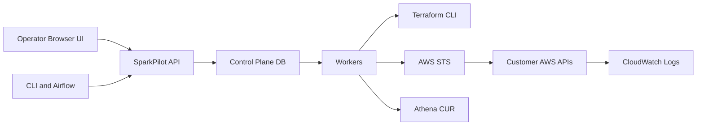

# Assumption-validation check-in
- Context validated by service owner:
  - API is internet-accessible until an API gateway is added.
  - UI is exposed to authenticated external users (not internal-only).
  - `X-Actor` is currently raw header trust with zero cryptographic binding and is the top security fix.
- Additional assumptions retained:
  - The primary deployment is a long-running SparkPilot control plane (`FastAPI` API + workers) that manages customer AWS resources and Spark runs.
  - `byoc_lite` is the dominant mode; `full` mode may be enabled in non-dry-run environments.
  - Data sensitivity includes customer metadata, run configuration, logs, and cross-account IAM role trust relationships.

## Executive summary
With internet exposure and external browser clients, the dominant risk is identity spoofing: shared bearer-token access combined with unbound `X-Actor` enables practical impersonation and privilege escalation. This is amplified by client-side API usage with `NEXT_PUBLIC` token configuration. The top mitigation is to cryptographically bind caller identity to authorization decisions (remove raw `X-Actor` trust), then harden internet-exposed edges with server-side auth brokering, rate limiting, and stricter bootstrap controls.

## Scope and assumptions
- In-scope runtime paths:
  - `src/sparkpilot/api.py`
  - `src/sparkpilot/services/`
  - `src/sparkpilot/aws_clients.py`
  - `src/sparkpilot/terraform_orchestrator.py`
  - `src/sparkpilot/config.py`
  - `src/sparkpilot/models.py`
  - `ui/lib/api.ts` and UI client pages
  - `infra/cloudformation/*.yaml`
  - `infra/terraform/control-plane/*.tf`
  - `providers/airflow/src/airflow/providers/sparkpilot/`
- Out of scope for threat ranking (supporting evidence only): tests, docs-only artifacts, and local developer scripts not used in production runtime.
- Runtime vs CI/dev separation:
  - Runtime focus: API, workers, DB, AWS calls, UI/browser/API paths, Airflow provider runtime behavior.
  - Non-runtime context only: test harness defaults (`tests/conftest.py`), local quickstart docs, and smoke scripts.
- Key assumptions used for prioritization:
  - API is internet-accessible and directly reachable by external clients.
  - UI runs in external user browsers and token compromise is plausible (bundle/config/browser inspection, leak, or replay).
  - `X-Actor` is currently caller-controlled and not identity-bound.
  - Customer bootstrap roles may vary in strictness (least privilege in some accounts, broad admin in others).

Open questions that would materially change ranking:
- Which IdP and token format will be authoritative for identity binding (OIDC JWT, signed session, or gateway-issued token).
- Target timeline for introducing API gateway/WAF and centralized throttling.
- Whether backward compatibility for current CLI/service tokens is required during migration.

## System model
### Primary components
- Control plane API (`FastAPI`) handling tenant, environment, job, run, logs, usage, and RBAC operations.
  - Evidence: `src/sparkpilot/api.py` route set (`@app.get/@app.post` decorators around lines 322-836), auth helpers `_require_api_auth`, `_resolve_access_context`.
- Persistent metadata and control state in SQLAlchemy-managed DB (SQLite/Postgres) for tenants, identities, environments, runs, audit events, idempotency records.
  - Evidence: `src/sparkpilot/models.py`, `src/sparkpilot/db.py`.
- Worker processes (`provisioner`, `scheduler`, `reconciler`, release sync, CUR reconciliation) pulling state from DB and invoking AWS/Terraform actions.
  - Evidence: `src/sparkpilot/workers.py`, `src/sparkpilot/services/workers_*.py`.
- AWS integration layer assuming customer roles and calling EMR on EKS, EKS, IAM, CloudWatch Logs, Athena.
  - Evidence: `src/sparkpilot/aws_clients.py` (`assume_role_session`, `start_job_run`, `filter_log_events`, IAM trust update/simulation methods), `src/sparkpilot/services/finops.py`.
- Full-BYOC Terraform orchestrator wrapper invoking `terraform plan/apply`.
  - Evidence: `src/sparkpilot/terraform_orchestrator.py` (`subprocess.run`, `-auto-approve`).
- Operator-facing UI and API client wrapper.
  - Evidence: `ui/lib/api.ts`, `ui/app/environments/environment-create-form.tsx`, `ui/app/runs/page.tsx`.
- Optional Airflow provider integration submitting/polling runs.
  - Evidence: `providers/airflow/src/airflow/providers/sparkpilot/hooks/sparkpilot.py`.

### Data flows and trust boundaries
- TB-1: Browser/UI/CLI/Airflow -> SparkPilot API
  - Data crossing: bearer token, `X-Actor`, idempotency keys, tenant/environment/job/run payloads, log query params.
  - Channel: HTTP/JSON.
  - Security guarantees: bearer token validation with constant-time compare (`hmac.compare_digest`), RBAC checks after actor resolution.
  - Validation/enforcement: Pydantic schemas (`src/sparkpilot/schemas.py`), role and environment/run access checks (`_require_environment_access`, `_require_run_access`), idempotency records (`with_idempotency`).
  - Gaps: internet-exposed entrypoint and actor identity is header-based, unauthenticated, and not cryptographically bound to token.
- TB-2: SparkPilot API -> Metadata DB
  - Data crossing: persistent control-plane state, idempotency records, audit events, budgets, usage/cost records.
  - Channel: SQLAlchemy ORM over SQLite/Postgres.
  - Security guarantees: ORM use reduces classic SQL injection; entity existence and relationship checks in service layer.
  - Validation/enforcement: `_require_*` entity helpers, unique constraints, check constraints.
- TB-3: Worker processes -> Metadata DB
  - Data crossing: run/provisioning claims, state transitions, failure details, audit metadata.
  - Channel: SQLAlchemy with claim tokens and TTL-based stale-claim recovery.
  - Security guarantees: optimistic claim logic and release to prevent duplicate processing.
  - Validation/enforcement: `_claim_runs`, `_claim_provisioning_operations`, `WORKER_CLAIM_TTL_SECONDS`.
- TB-4: Workers -> AWS STS/IAM/EMR/EKS/CloudWatch/Athena in customer accounts
  - Data crossing: role ARNs, temporary credentials, run metadata, log group/stream identifiers, IAM trust policy docs.
  - Channel: AWS API calls via `boto3`.
  - Security guarantees: role-based API permissions in customer accounts, optional policy simulation and preflight checks.
  - Validation/enforcement: BYOC preflight checks, role ARN format checks, namespace/account alignment checks.
  - Gaps: `assume_role_session` does not pass `ExternalId`, despite design/docs and templates requiring it.
- TB-5: Provisioner worker -> local Terraform binary
  - Data crossing: stage vars (`tenant_id`, `environment_id`, `region`, `workspace`, `state_key`) and plan/apply outputs.
  - Channel: local subprocess execution (`subprocess.run`).
  - Security guarantees: command list invocation (not shell), binary/path existence validation, timeouts.
  - Gaps: `terraform apply -auto-approve` raises blast radius if control plane is compromised.
- TB-6: API -> CloudWatch logs proxy path (on behalf of requester)
  - Data crossing: run IDs, log group, log stream prefix, customer role assumption for log read.
  - Channel: API -> DB lookup -> worker AWS client calls.
  - Security guarantees: run-level RBAC checks before log fetch.
  - Gaps: if actor spoofing is possible, logs become easier to exfiltrate.
- TB-7: UI browser -> API with embedded token
  - Data crossing: Authorization header from browser context.
  - Channel: browser fetch calls from client components.
  - Security guarantees: none beyond token secrecy and API checks.
  - Gaps: external-user browser context plus `NEXT_PUBLIC_SPARKPILOT_API_TOKEN` creates high token exposure risk.

#### Diagram

## Assets and security objectives
| Asset | Why it matters | Security objective (C/I/A) |
| --- | --- | --- |
| API bearer tokens | Token possession grants API access and can enable role impersonation flows | C, I |
| Actor identity and RBAC mappings (`UserIdentity`, team scopes) | Governs tenant/run/environment isolation and admin operations | I |
| Customer role ARNs and assumed-role capability | Enables cross-account cloud actions (EMR, IAM trust updates, logs) | C, I |
| Environment/job/run definitions | Drive workload execution, cost, and cloud resource targeting | I, A |
| Audit events | Needed for accountability, incident response, and tenant attribution | I, A |
| Run logs and diagnostics | May contain sensitive workload output and error context | C |
| Terraform stage artifacts/checkpoints | Influence provisioning integrity and recovery behavior | I, A |
| Cost/usage records and budget state | Influence governance, chargeback, and enforcement decisions | I |

## Attacker model
### Capabilities
- Remote caller who can reach API endpoints and can attempt token misuse/replay.
- Malicious insider or tenant operator with some valid token access and ability to craft direct HTTP requests.
- Attacker with access to browser-delivered UI JavaScript or env-leaked frontend config values.
- Compromised automation endpoint (CI/Airflow) that stores API token and can call mutating endpoints.

### Non-capabilities
- No assumed kernel/container escape from host infrastructure is considered here.
- No direct DB filesystem access is assumed unless control plane host is already compromised.
- No direct AWS account root compromise is assumed; abuse is modeled via granted IAM role paths.

## Entry points and attack surfaces
| Surface | How reached | Trust boundary | Notes | Evidence (repo path / symbol) |
| --- | --- | --- | --- | --- |
| `/v1/*` API routes | HTTP requests from UI/CLI/Airflow | TB-1 | Main control plane entry for tenants, envs, jobs, runs, logs, usage | `src/sparkpilot/api.py` route decorators |
| `/healthz` | Unauthenticated GET | TB-1 | Service discovery/probing surface | `src/sparkpilot/api.py` `@app.get("/healthz")` |
| Bearer token auth | Authorization header | TB-1 | Shared-token auth list, compare_digest checks | `src/sparkpilot/api.py` `_require_api_auth`; `src/sparkpilot/config.py` `api_bearer_token_list` |
| `X-Actor` header | Caller-provided header | TB-1 | Actor string drives RBAC identity lookup and audit actor field | `src/sparkpilot/api.py` `_actor_and_ip`, `_resolve_access_context` |
| Bootstrap legacy admin path | First authenticated actor before identities exist | TB-1 | Grants temporary admin when no identities are configured | `src/sparkpilot/api.py` `_resolve_access_context` (`if not _has_any_identities`) |
| UI browser API wrapper | Client-side fetch with auth headers | TB-7 | `NEXT_PUBLIC` token and client components can expose token in browser | `ui/lib/api.ts`, `ui/app/environments/environment-create-form.tsx`, `ui/app/runs/page.tsx` |
| Worker CLI entrypoint | Local process command execution | TB-3/TB-5 | Long-running workers process queued ops and runs | `src/sparkpilot/workers.py` |
| AWS role assumption and EMR dispatch | Worker boto3 calls | TB-4 | Cross-account role assumption and EMR/EKS/IAM actions | `src/sparkpilot/aws_clients.py` `assume_role_session`, `start_job_run`, trust policy methods |
| Terraform orchestration | Provisioner subprocess execution | TB-5 | Executes `terraform plan/apply` with `-auto-approve` | `src/sparkpilot/terraform_orchestrator.py` |
| CloudWatch log proxy endpoint | `GET /v1/runs/{run_id}/logs` | TB-6 | Server-side log fetch on customer role | `src/sparkpilot/api.py` `get_run_logs`; `src/sparkpilot/services/crud.py` `fetch_run_logs`; `src/sparkpilot/aws_clients.py` `filter_log_events` |
| Airflow provider hook | Outbound HTTP from Airflow tasks | TB-1 | Can run unauthenticated if token missing in connection | `providers/airflow/.../hooks/sparkpilot.py` `resolve_connection`, warning on missing token |
| CUR reconciliation query builder | Worker Athena query execution | TB-4 | Includes explicit identifier/literal validation controls | `src/sparkpilot/services/finops.py` `_build_cur_reconciliation_query` |

## Top abuse paths
1. Attacker goal: full control-plane takeover via leaked frontend token.
   1. Obtain token from browser-exposed `NEXT_PUBLIC_SPARKPILOT_API_TOKEN` or client bundle/config leak.
   2. Call `/v1/*` directly with bearer token and forged `X-Actor`.
   3. Create/update identities, tenants, environments, and submit runs.
   4. Impact: cross-tenant control-plane compromise and cloud action abuse.
2. Attacker goal: bootstrap-admin race on new deployment.
   1. Reach API with any valid bearer token before identities are seeded.
   2. Send privileged call as arbitrary actor.
   3. Receive implicit `legacy_mode` admin context when no identities exist.
   4. Persist attacker-controlled identities and scopes.
   5. Impact: durable administrative persistence.
3. Attacker goal: cross-account cloud abuse using environment registration.
   1. Use admin-level API access to create environment with attacker-chosen `customer_role_arn`.
   2. Trigger provisioning/scheduling paths that call STS assume role and EMR/IAM APIs.
   3. Use assumed permissions to mutate resources or run workloads in customer account.
   4. Impact: integrity loss and financial/resource abuse in external accounts.
4. Attacker goal: bypass tenant intent via actor spoofing.
   1. Reuse shared bearer token.
   2. Set `X-Actor` to another user/admin identity.
   3. Access run data/logs or perform forbidden mutations through impersonated role.
   4. Impact: cross-tenant data exposure, unauthorized operations, weak non-repudiation.
5. Attacker goal: operational denial of service.
   1. Flood mutating endpoints (`/v1/environments`, `/v1/jobs/{id}/runs`) with valid auth.
   2. Trigger expensive preflight, worker reconciliation, and cloud API churn.
   3. Saturate worker loops, DB, and cloud rate limits.
   4. Impact: degraded availability for legitimate tenants and delayed run processing.
6. Attacker goal: extract sensitive run output.
   1. Gain token and actor context with run access.
   2. Enumerate runs and call `/v1/runs/{id}/logs`.
   3. Retrieve CloudWatch log events through server-side proxy.
   4. Impact: confidentiality breach of workload output and diagnostics.
7. Attacker goal: destructive provisioning operations in full mode.
   1. Compromise admin API access.
   2. Trigger full-mode provisioning operations repeatedly.
   3. Provisioner executes Terraform `apply -auto-approve` under privileged role paths.
   4. Impact: unintended infrastructure mutation and cost impact.

## Threat model table
| Threat ID | Threat source | Prerequisites | Threat action | Impact | Impacted assets | Existing controls (evidence) | Gaps | Recommended mitigations | Detection ideas | Likelihood | Impact severity | Priority |
| --- | --- | --- | --- | --- | --- | --- | --- | --- | --- | --- | --- | --- |
| TM-001 | External attacker or malicious insider with token access | API token is exposed/reused (for example from frontend or automation) and API is reachable | Use leaked token plus forged `X-Actor` to perform privileged API operations | Full control-plane compromise and cross-tenant unauthorized actions | API tokens, RBAC state, tenant/env/run integrity, customer role actions | Bearer token check (`src/sparkpilot/api.py` `_require_api_auth`), RBAC checks (`_require_environment_access`, `_require_run_access`), security tests (`tests/test_rbac.py`) | Actor is caller-supplied and not bound to token; UI client uses `NEXT_PUBLIC` token (`ui/lib/api.ts`) | Replace shared bearer tokens with per-user OIDC/JWT and signed identity claims; reject external caller-supplied `X-Actor` and derive actor from verified token subject/claims; remove `NEXT_PUBLIC` token usage; enforce server-side session/auth proxy for UI; rotate and scope tokens | Alert on actor switching per source IP/token, admin operation spikes, unusual identity mutations | high | high | critical |
| TM-002 | Opportunistic attacker during bootstrap | Fresh deployment with zero `UserIdentity` rows and valid bearer token | Exploit legacy bootstrap path to gain admin (`legacy_mode=True`), then create persistent identities | Initial takeover and long-term admin persistence | RBAC mappings, tenant boundaries, audit trust | Legacy-mode fallback is explicit (`src/sparkpilot/api.py` `_resolve_access_context`); admin-only guards exist once identities exist | No bootstrap lock/one-time enrollment proof beyond token possession | Add explicit bootstrap secret/one-time setup flow; disable legacy mode by default in non-dev; fail closed if identities missing in production | Alert when first identity is created; alert if admin actions occur before bootstrap completion flag | medium | high | high |
| TM-003 | Malicious tenant admin or compromised control plane creds | Ability to create environments and customer role onboarding not tightly constrained | Register/target role ARNs that enable cross-account actions via assumed role workflow | Cross-account integrity impact, unintended cloud actions, cost and trust boundary breach | Customer role trust, cloud resources, billing | BYOC checks and IAM simulation (`src/sparkpilot/services/preflight_byoc.py`), account/namespace checks, template guidance for ExternalId (`infra/cloudformation/*.yaml`) | Runtime STS assume role call omits `ExternalId` (`src/sparkpilot/aws_clients.py` `assume_role_session`); onboarding policy strictness depends on customer configuration | Pass and enforce `ExternalId` in all assume-role calls; require allowlisted account IDs/role patterns per tenant; verify trust-policy conditions during onboarding | Log and alert on assume-role targets per tenant, cross-account anomalies, and trust-policy update operations | medium | high | high |
| TM-004 | Authenticated attacker with admin or spoofed-admin context | Can call env/job/run mutating endpoints | Submit malicious job artifacts/configs and trigger execution in customer AWS through EMR on EKS | Data-plane workload integrity compromise and cost abuse | Job/run definitions, customer compute resources, cost allocations | Spark conf policy blocks sensitive k8s auth keys (`src/sparkpilot/services/_helpers.py`), quota checks (`src/sparkpilot/quota.py`), preflight checks (`src/sparkpilot/services/preflight.py`) | No artifact allowlist/signature enforcement; job artifact URI trust is caller-controlled | Enforce artifact registry allowlist + signature verification; tenant-specific policy for allowed `artifact_uri` prefixes; stronger approval workflow for admin/job changes | Alert on new artifact domains, abnormal run volume/cost by tenant, and repeated failed preflight bypass attempts | medium | high | high |
| TM-005 | Compromised admin/control-plane runtime | Full mode enabled and attacker can trigger provisioning operations | Abuse Terraform plan/apply automation (`-auto-approve`) to mutate infrastructure aggressively | Infrastructure integrity loss and high financial impact | Provisioning state, customer infrastructure, audit trust | Stage checkpoints/audits (`workers_provisioning.py`), runtime prereq checks (`terraform_orchestrator.py`) | Auto-approve removes human gate; blast radius depends on role scope | Add policy-as-code guardrails and approval gates for high-risk stages; separate provisioning role with tighter permissions; require change-set review for prod | Alert on repeated full-mode apply operations, unexpected stage transitions, and Terraform error bursts | medium | high | high |
| TM-006 | Authenticated abusive client | Valid token and network reachability | Flood run/env/job endpoints and expensive read paths (logs/preflight), exhausting API/worker/cloud quotas | Availability degradation and delayed processing | API/worker availability, DB performance, tenant SLOs | Worker claim TTL controls (`workers_common.py`), idempotency for mutating routes (`src/sparkpilot/idempotency.py`) | No explicit API rate limiting/admission control in repo runtime; idempotency does not stop unique-key floods | Add rate limits per token/actor/tenant and request budgets; queue backpressure and max in-flight caps; WAF/API gateway throttling | Monitor request rate anomalies, queue depth, worker lag, cloud API throttling errors | high | medium | high |
| TM-007 | Token holder with spoofed or overbroad actor privileges | Token valid and actor identity not strongly bound | Read logs and operational metadata via run enumeration and log proxy endpoints | Confidentiality loss for run output/diagnostics and forensic ambiguity | Run logs, diagnostics, audit attribution | Run access checks and tenant scoping logic (`src/sparkpilot/api.py`), multi-tenant tests (`tests/test_api.py::test_multi_tenant_concurrent_runs_enforce_isolation_invariants`) | Audit `actor` field can be forged if actor identity is spoofable; log exposure follows access context | Bind actor to upstream identity; include immutable principal ID in audit records; redact sensitive log fields at proxy layer | Alert on atypical log-read patterns (cross-team, high-volume) and actor/source mismatches | medium | medium | medium |

## Criticality calibration
- `critical`
  - Definition for this repo: likely compromise of control-plane authority or cross-tenant boundary with high-confidence exploitation path.
  - Example: internet-exposed UI/API token leakage + actor spoofing leading to admin operations (`TM-001`).
  - Example: authenticated takeover during bootstrap legacy-admin window (`TM-002`) in exposed environments.
- `high`
  - Definition for this repo: material integrity/availability or cross-account cloud abuse requiring some preconditions.
  - Example: cross-account assume-role misuse due weak onboarding + missing ExternalId enforcement (`TM-003`).
  - Example: provisioning abuse through full-mode Terraform automation (`TM-005`).
  - Example: authenticated DoS against API/worker/cloud limits (`TM-006`).
- `medium`
  - Definition for this repo: meaningful confidentiality/integrity issues with narrower blast radius or stronger preconditions.
  - Example: run-log data exposure from overbroad or spoofed actor context (`TM-007`).
  - Example: malicious but authenticated workload payload abuse constrained by quotas/preflight (`TM-004` in strongly isolated tenant deployments).
- `low`
  - Definition for this repo: low-sensitivity leaks or issues requiring unlikely chains not supported by current evidence.
  - Example: health endpoint probing without auth (`/healthz`) with no further exploit path.
  - Example: non-sensitive metadata disclosure already visible to authorized operators.

## Focus paths for security review
| Path | Why it matters | Related Threat IDs |
| --- | --- | --- |
| `src/sparkpilot/api.py` | Central authn/authz, actor resolution, and all API entrypoints | TM-001, TM-002, TM-006, TM-007 |
| `src/sparkpilot/config.py` | Token defaults and runtime auth safety checks | TM-001, TM-002 |
| `ui/lib/api.ts` | Browser-visible token and auth header construction | TM-001 |
| `ui/app/environments/environment-create-form.tsx` | Client-side privileged environment creation path | TM-001, TM-004 |
| `ui/app/runs/page.tsx` | Client-side run submission, preflight, and logs flows | TM-001, TM-007 |
| `src/sparkpilot/services/crud.py` | Environment/job/run creation logic and policy enforcement | TM-003, TM-004 |
| `src/sparkpilot/services/_helpers.py` | Spark config policy denylist enforcement | TM-004 |
| `src/sparkpilot/quota.py` | Run admission and vCPU/concurrency quota checks | TM-004, TM-006 |
| `src/sparkpilot/idempotency.py` | Replay/conflict behavior for mutating requests | TM-006 |
| `src/sparkpilot/aws_clients.py` | STS assume-role behavior, trust policy updates, log retrieval, EMR dispatch | TM-003, TM-004, TM-007 |
| `src/sparkpilot/services/preflight_byoc.py` | BYOC-Lite IAM/OIDC/dispatch controls and assumptions | TM-003, TM-004 |
| `src/sparkpilot/services/workers_scheduling.py` | Run dispatch pipeline and transient failure handling | TM-004, TM-006 |
| `src/sparkpilot/services/workers_reconciliation.py` | Terminal state handling, timeout cancellation, diagnostic recording | TM-006, TM-007 |
| `src/sparkpilot/services/workers_provisioning.py` | BYOC provisioning state machine and trust policy automation | TM-003, TM-005 |
| `src/sparkpilot/terraform_orchestrator.py` | Terraform subprocess execution and auto-approve behavior | TM-005 |
| `infra/cloudformation/customer-bootstrap.yaml` | Full BYOC IAM permissions and trust policy assumptions | TM-003, TM-005 |
| `infra/cloudformation/customer-bootstrap-byoc-lite.yaml` | BYOC-Lite least-privilege baseline and tag-based constraints | TM-003, TM-004 |
| `providers/airflow/src/airflow/providers/sparkpilot/hooks/sparkpilot.py` | External integration auth behavior and unauthenticated request risk | TM-001, TM-006 |
| `tests/test_rbac.py` | Evidence of intended tenant/team/run isolation controls | TM-001, TM-007 |
| `tests/test_security_hardening.py` | Evidence of insecure-auth bypass constraints by environment | TM-001, TM-002 |
